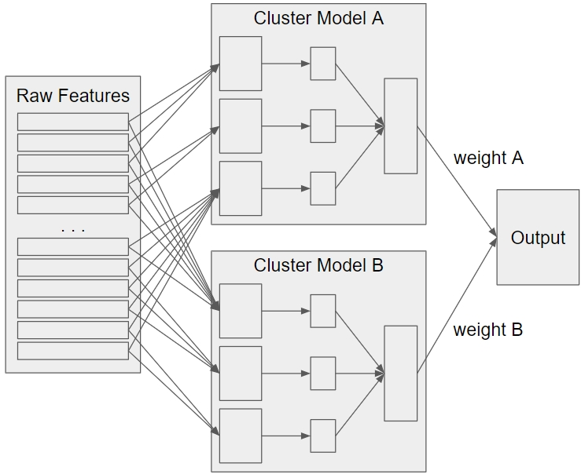

<h1>Jain Street Cluster Ensemble Solution</h1>

Kaggle - Jane Street Market Prediction    
https://www.kaggle.com/c/jane-street-market-prediction   
본 repository는 data가 포함되어 있지 않으며, inference 코드는 Kaggle Notebook에서, 그 외의 코드는 Google Colab 에서의 구동을 전제로 합니다.   

<h2>Project details</h2>

|||
|---|---|
|Period|2021.01 ~ 2021.02|
|Team|Juyoung Ha, Sunghoon Jo|
|Rank|Top 31%|
|Accuracy|0.545|

|Tech|Detail|
|---|---|
||Main algorism|
||Prediction model|

<h2>Model Explanation</h2>

위 모델에서 표현된 Cluster Model A, B는 단순화를 위해 두 블럭만 표현하였으며, 실제 모델은 총 5개의 Cluster Model을 활용하였습니다. 자세한 사항은 아래의 Clustering 항목에서 확인할 수 있습니다.

본 프로젝트에서는 미래의 시장가격 변동을 현재 주어진 Feature들을 활용해 예측하여 거래 여부를 결정하여야 합니다.
많은 Feature를 가진 Train.csv와 각 Feature들의 정보를 담은 Tag를 제공하는 Features.csv가 제공됩니다.
본 프로젝트는 다음과 같은 특징을 가집니다.

1. 아주 큰 Variance를 가지고 있기에, 높은 정확도의 예측이 어렵다.
2. 주어진 각 Feature들은 상호간에 복잡한 상관관계를 가지며, 예측 Target에 미치는 영향이 명확하지 않다.
3. 주어진 데이터의 시장 상황에 따라 overfit이 발생하기 매우 쉽다.

따라서 우선 Neural Network를 구성하기 전에, 유사한 Feature끼리 Clustering을 진행하고, 동일한 그룹끼리 dense layer를 구성, 
해당 layer들의 output을 모아 다시 dense layer를 거쳐 최종 output을 예측하도록 구성하였습니다.  
하지만 Feature간의 관계가 매우 복잡하여 이 과정에서 사용된 단일 Cluster Model이 충분히 합리적인지에 대한 문제점이 남아있기에, 본 모델에서는 다양한 Clustering 기법을 활용하여 다수의 Cluster Model을 통한 예측을 수행하였습니다. 
마지막으로 각 Cluster Model의 시장 예측값들에 weight를 곱해주게 되는데, 이 weight 또한 gradient descent로 학습됩니다.

<h2>Clustering</h2>

* feature_corr_clust_km.txt
    - K-means with Elbow method
    - Train.csv 내 각 feature들의 피어슨 상관관계 기반
    - Elbow method 를 활용해 적합한 K를 찾아 K-means 클러스터링

* feature_corr_clust_dn.txt
    - Hierarchical clustering
    - Train.csv 내 각 feature들의 피어슨 상관관계 기반

* feature_corr_spr_clust_dn.txt
    - Hierarchical clustering
    - Train.csv 내 각 feature들의 Spearman 상관관계 기반

* feature_clust_db.txt
    - DBSCAN clustering
    - Train.csv 내 각 feature들의 Spearman 상관관계 기반
 

* feature_nan_clust.txt (최종 모델에서 생략)
    - Train.csv 내 각 feature의 NaN 데이터 개수 기반 클러스터링

* feature_tags_clust.txt (최종 모델에서 생략)
    - K modes clustering
    - Features.csv 내 Tag 기반

* feature_tag_lsi.txt
    - Latent Semantic Indexing 기반 Topic modeling
    - Features.csv 내 Tag 기반

<h2>Limitation</h2>

본 모델은 주어진 한 시점의 Feature들을 활용하기에 연속된 시계열 데이터의 이점을 살리지 못 합니다.
해당 한계를 극복하기 위해 LSTM과 같은 RNN블럭 도입, Temporal Fusion Transformer 등을 고려해볼 수 있습니다.
